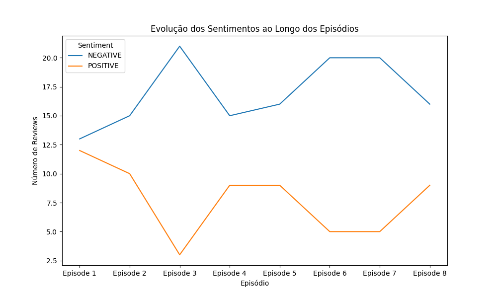
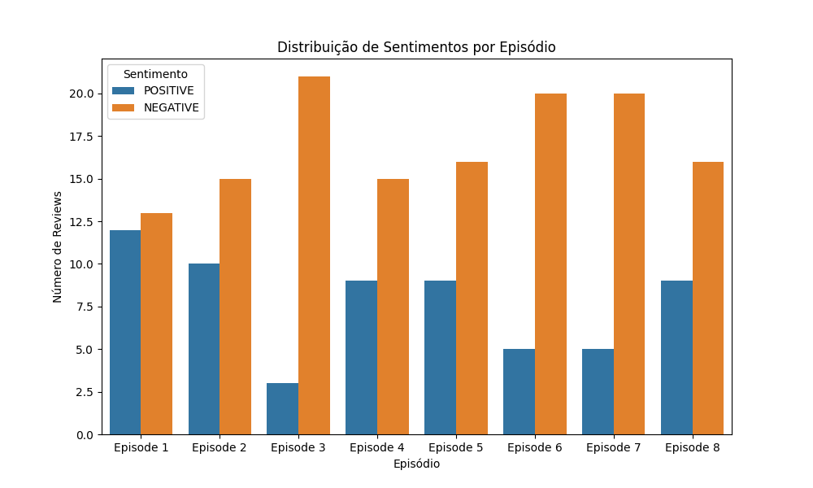
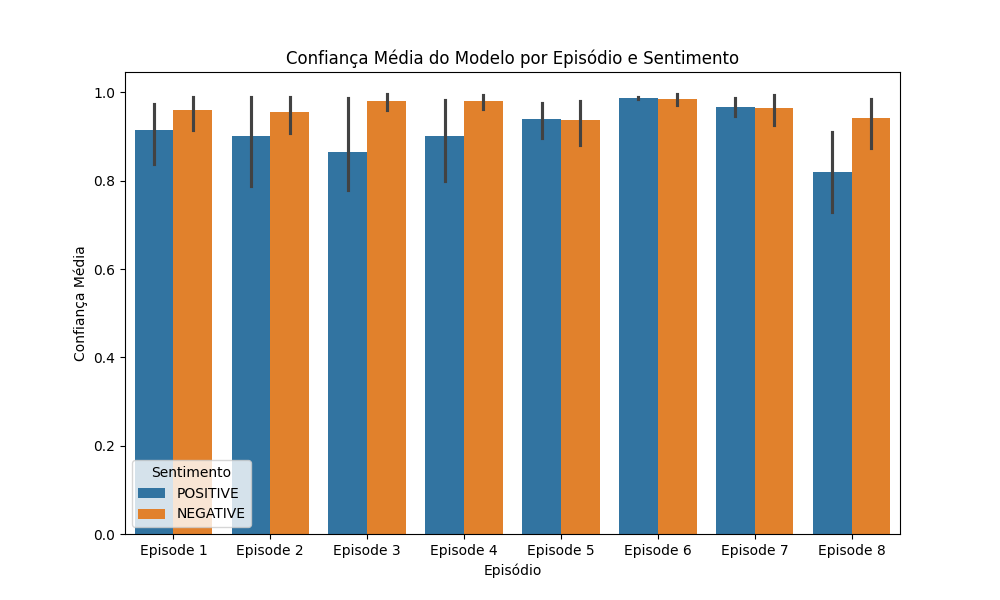

# The Acolyte Episode Reviews Sentiment Analysis

## Overview
This project performs a **sentiment analysis** on IMDb user reviews for each episode of the series *The Acolyte*. The project involves **scraping** the reviews, **preprocessing** the text, and performing sentiment analysis using a pre-trained transformer model. The goal is to analyze how viewers perceive each episode and visualize the sentiment trends over the course of the series.

## Technologies Used
- **Python** for scripting and data manipulation.
- **BeautifulSoup** for web scraping IMDb reviews.
- **SpaCy** for text preprocessing (tokenization, lemmatization, stopword removal).
- **Hugging Face Transformers** for sentiment classification.
- **Pandas** for data handling.
- **Matplotlib** and **Seaborn** for visualization.

## Project Structure
- `acolyte_reviews_sentiment_analysis.py`: Unified script for scraping, preprocessing, and sentiment analysis.
- `tests/`: Modularized code for each step (scraping, preprocessing, and sentiment analysis).
- `Results/`: Folder containing the sentiment analysis results and the visualizations.
- `imdb_sentiment_reviews_all_episodes.csv`: The final dataset containing the sentiment analysis results.

## How to Run the Project
1. Install the dependencies using:
   ```bash
   pip install -r requirements.txt
   ```
2. Run the unified script:
   ```bash
   python acolyte_reviews_sentiment_analysis.py
   ```

This will scrape reviews from IMDb, process the text, perform sentiment analysis, and generate the results in the `Results` folder.

## Results

### 1. Sentiment Evolution Across Episodes
This graph shows how positive and negative sentiments evolved throughout the series.



- Negative sentiment is dominant in most episodes, especially in episode 3.
- Positive reviews show some fluctuations but tend to be lower, with dips in episodes 3 and 6.

### 2. Sentiment Distribution per Episode
The following graph illustrates the number of positive and negative reviews for each episode.



- Episode 3 has the highest number of negative reviews.
- Episode 5 shows a slight increase in positive reviews, though still fewer than negative ones.

### 3. Model Confidence by Episode
The graph below highlights the model's confidence levels for both positive and negative classifications.



- The model demonstrates high confidence in both positive and negative classifications.
- Confidence tends to be higher for negative reviews, indicating the model was more certain about negative sentiments.

## Dataset
The full sentiment analysis dataset can be found in the `Results/imdb_sentiment_reviews_all_episodes.csv`. It includes:
- **Episode**: The episode number.
- **Review**: The original review.
- **Processed_Review**: The cleaned and processed review text.
- **Sentiment**: The predicted sentiment (positive or negative).
- **Confidence**: The confidence score of the prediction.

## Conclusion
The sentiment analysis reveals that *The Acolyte* received more negative than positive feedback across most episodes, with episode 3 standing out as the most criticized. Positive reviews, while present, are consistently lower in number across all episodes. The model's high confidence in its predictions adds reliability to these results.
